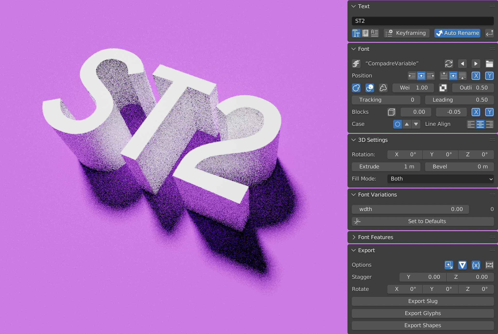

# ST2

### Download

Grab the latest zip from [coldtype.xyz/st2](https://coldtype.xyz/st2)

### Why?

Blender is a very cool program that does a ton of things very well. One of the things it does _not_ do very well is typography (for example, even basic typographical features like kerning are not supported).

That’s why ST2 exists: an add-on to help you set 3D type with the full range of modern typographical features — among them OpenType stylistics sets, ligatures, and, yes, kerning. ST2 also provides support for typesetting all kinds of languages (not just Latin-based ones).

Also Blender does not have support for variable fonts; this add-on adds support for those, along with support for keyframing variable font axes. (This is a little experimental though, as Blender will sometimes crash if you change meshes too often, particularly on macOS. To get around this, the ST2 add-on provides an "export" mechanism that will create a new object for every frame of your animation, and then show that instance on the appropriate frame only.)

### Installing

1. Download this repo to your computer
2. `cd` into the repo directory in a terminal (very important)
3. Using your system python (any version), install [`b3denv`](https://github.com/coldtype/b3denv):
    - `pip install b3denv`
4. Now that you have b3denv installed, you can just call:
    - `b3denv setup`
5. Now you can launch blender with b3denv and ST2 should be installed:
    - `b3denv`
    - (launching this way ensures the debug output of Blender is visible, so if there are problems with ST2, you should see them in your terminal)

N.B. Though there used to be bundled zip versions of this extension to install, because there are so many versions of Blender and they each embed a different version of Python (and because ST2 relies on version-specific precompiled C binaries), I’ve discontinued the prebuilt zip versions of this extension.